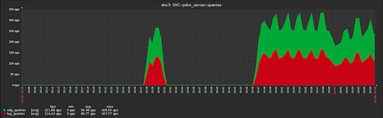

# PowerDNS Server template
#### Version: 1.0.1

#### Description:
PowerDNS Server service monitoring template. This template is using:
- Zabbix active agent items
- powerdns webserver api (over http://localhost:8081)
- tested on Zabbix 4.0.x and PowerDNS 4.2

#### Macros used by template:
| Macro                    | Default value       | Description                                         |
| :----------------------- | :------------------ | :-------------------------------------------------- |
| {$SVC_PDNS_SERVER_IP}    | 127.0.0.1           | IP address of webserver                             |
| {$SVC_PDNS_SERVER_PORT}  | 8081                | TCP port                                            |

#### Graphs
- SVC::pdns_server::memory
- SVC::pdns_server::answers
- SVC::pdns_server::queries

<p align=center>

</p>

#### Triggers
- SVC::pdns_server process is DOWN


#### Notes:
- To use this template add pdns.conf configuration file:
```
# webserver	Start a webserver for monitoring (api=yes also enables the HTTP listener)
webserver=yes
# webserver-address	IP Address of webserver/API to listen on
webserver-address=127.0.0.1
# webserver-allow-from	Webserver/API access is only allowed from these subnets
webserver-allow-from=127.0.0.1,::1
# webserver-password	Password required for accessing the webserver
# DON'T SET PASSWORD
# webserver-password=
# webserver-port	Port of webserver/API to listen on
webserver-port=8081
# webserver-print-arguments	If the webserver should print arguments
# webserver-print-arguments=no
```
